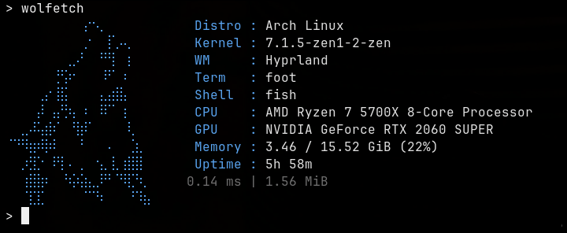

<div align="center">
  <h1>wolfetch</h1>
  <p><strong>Ultra-fast. Minimal by design.</strong></p>
  <p>
    <a href="https://github.com/TrueWulf/wolfetch/actions/workflows/ci.yml"></a>
    <a href="https://github.com/TrueWulf/wolfetch/releases"></a>
    <a href="LICENSE"></a>
  </p>
  
</div>

wolfetch is a small command-line system summary with a minimal wolf beside it.
It starts almost instantly, stays easy to understand, and gives you useful
information without daemons, background services, or a complicated config
format.

## Quick Start

```sh
wolfetch
wfetch
wolfetch --plain
wolfetch --json
```

## Features

- Ultra-fast startup and a small native binary.
- Minimal royal-blue terminal output.
- Configurable fields and field order.
- JSON, plain, fast and no-logo modes.
- `--minimal` mode for a compact, low-cost summary.
- Simple `key=value` configuration.
- No system service or runtime daemon.
- No shell commands executed from configuration.

## Benchmark

Honest local Hyperfine benchmark for wolfetch, pfetch-rs, Fastfetch and
Macchina. See [`benchmarks/results.md`](benchmarks/results.md) for hardware,
versions, commands and measured output.

Run the reproducible benchmark yourself:

```sh
bash benchmarks/startup.sh
```

## Installation

Use the [Installation guide](docs/installation.md) for package-manager
commands, release archives and building from source.

The latest downloads are available in
[GitHub Releases](https://github.com/TrueWulf/wolfetch/releases).

## Configuration

```ini
theme=royal
show=distro,kernel,host,wm,de,term,shell,cpu,gpu,memory,disk,load,uptime
logo=wolf
show_runtime=true
show_process_memory=true
```

See [configuration.md](docs/configuration.md) for all fields and options.

## Support

Linux is the primary tested platform. FreeBSD, OpenBSD, NetBSD and DragonFly
BSD are active pre-release targets. See the
[platform support status](docs/platform-support.md) for details.

## License

GPLv3. See [LICENSE](LICENSE).
